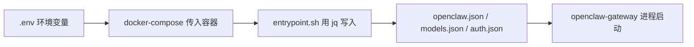

<div align="center">

# 🦅 OpenClaw 本地部署

**Windows + Docker 一键部署方案**

在 Windows + Docker Desktop 上运行 OpenClaw AI 网关的完整部署模板

[](https://www.docker.com/)
[](https://www.microsoft.com/windows)
[](https://docs.microsoft.com/powershell/)

</div>

---

## 📋 目录

- [架构概览](#-架构概览)
- [目录结构](#-目录结构)
- [前置要求](#-前置要求)
- [快速开始](#-快速开始)
- [自定义镜像](#-自定义镜像dockerfile)
- [配置注入机制](#-配置注入机制entrypointsh)
- [运维命令](#-运维命令)
- [模型配置](#-模型配置)
- [可选功能](#-可选定时任务模板)
- [安全说明](#-安全说明)
- [常见问题](#-常见问题)

---

## 🏗️ 架构概览

### 🖥️ 部署架构

OpenClaw 运行在 Docker 容器中，通过本地端口提供服务：

```
Windows 主机
    └─ Docker Desktop (WSL2)
        ├─ openclaw-gateway 容器
        │   ├─ 端口 18789 → Web UI / API
        │   ├─ 端口 18790 → IDE Bridge
        │   └─ 端口 18792 → Browser Relay
        │
        └─ openclaw-cli 容器 (可选)
            └─ 交互式命令行工具

访问方式: http://127.0.0.1:18789
```

### 🔌 服务端口

| 端口 | 服务 | 说明 |
|:-----|:-----|:-----|
| **18789** | Web UI / API | 网关控制台 & OpenAI 兼容 API 接口 |
| **18790** | IDE Bridge | Cursor / VSCode 等 IDE 桥接服务 |
| **18792** | Browser Relay | 浏览器控制中继服务 |

> 🔒 所有端口仅绑定 `127.0.0.1`，不对外网或局域网暴露

### 📂 数据卷挂载

| 主机路径 | 容器路径 | 说明 |
|:---------|:---------|:-----|
| `./volumes/openclaw/config/` | `/root/.config/openclaw/` | AI 配置文件 & 运行时状态 |
| `./volumes/openclaw/workspace/` | `/root/.openclaw/` | AI 工作区（记忆、技能、日记） |
| `${PROJECTS_DIR}` | `/workspace/projects/` | 项目目录（可自定义） |
| `${DESKTOP_DIR}` | `/workspace/desktop/` | 桌面目录（可自定义） |

---

## 📁 目录结构

<details>
<summary>点击展开完整目录树</summary>

```
openclaw/
├── 📦 deploy/openclaw/            # OpenClaw 网关部署（主体）
│   ├── docker-compose.yml         # 服务编排
│   ├── Dockerfile                 # 自定义镜像（基于官方镜像扩展工具链）
│   ├── entrypoint.sh              # 启动注入脚本（从环境变量写入配置）
│   ├── .env.example               # 环境变量模板（复制为 .env 后填写）
│   ├── .env                       # 本地环境变量（不提交 Git）
│   ├── 🛠️ ops/                    # 运维脚本
│   │   ├── start.ps1              # 启动网关
│   │   ├── stop.ps1               # 停止网关
│   │   ├── status.ps1             # 查看容器状态
│   │   ├── logs.ps1               # 查看日志
│   │   └── dashboard.ps1          # 打开控制台
│   └── 💾 volumes/                # 运行时数据（不提交 Git）
│       ├── openclaw/config/       # openclaw.json、模型/会话配置
│       └── openclaw/workspace/    # AI 工作区（记忆、技能、日记）
│
├── compose.yaml                   # 可选：定时任务模板（Redis + Worker）
├── config/tasks.yaml              # Worker 任务配置
├── services/worker/               # Worker 服务源码（Python）
├── skills/                        # 全局技能（通过 clawhub 安装）
├── ops/                           # 根目录运维脚本
├── .gitignore
└── README.md
```

</details>

## ✅ 前置要求

| 软件 | 版本要求 | 说明 |
|:----:|:--------:|:-----|
| 🪟 **Windows** | 10 / 11 | WSL2 需已启用 |
| 🐳 **Docker Desktop** | 4.x+ | 启用 WSL2 backend |
| 💻 **PowerShell** | 5.1+ | 运维脚本依赖 |

**验证环境：**

```powershell
wsl --status
docker version
docker compose version
```

---

## 🚀 快速开始

### 步骤 1️⃣：克隆仓库

```powershell
git clone https://github.com/AI-Wallfacer/Open_Claw_windows.git
cd openclaw
```

### 步骤 2️⃣：配置环境变量

```powershell
cd deploy\openclaw
Copy-Item .env.example .env
```

编辑 `.env`，填写以下必填项：

> 💡 **提示**：`OPENCLAW_GATEWAY_TOKEN` 可使用以下命令生成随机 token：
> ```powershell
> -join ((48..57) + (97..102) | Get-Random -Count 64 | ForEach-Object {[char]$_})
> ```

```ini
# Gateway 访问令牌（自行生成一个随机 hex 串）
OPENCLAW_GATEWAY_TOKEN=your_64_hex_token_here

# 自定义 API 中转地址和密钥
SELF_API_URL=https://your-api-proxy.example.com/v1
SELF_API_KEY=sk-your-api-key

# 飞书机器人（可选，不用飞书留空即可）
FEISHU_APP_ID=cli_xxxx
FEISHU_APP_SECRET=your_secret

# 本机目录挂载（按实际路径填写）
PROJECTS_DIR=D:/your/projects
DESKTOP_DIR=C:/Users/YourName/Desktop
```

### 步骤 3️⃣：启动服务

```powershell
.\ops\start.ps1
```

**脚本会自动完成：**

- ✅ 创建 `volumes/` 目录结构
- ✅ 拉取最新镜像
- ✅ 构建自定义镜像（包含工具链扩展）
- ✅ 启动 `openclaw-gateway` 容器

### 步骤 4️⃣：访问控制台

浏览器打开：**[http://127.0.0.1:18789](http://127.0.0.1:18789)**

使用 `.env` 中配置的 `OPENCLAW_GATEWAY_TOKEN` 登录。

---

## 🔧 自定义镜像（Dockerfile）

基于官方 `ghcr.io/openclaw/openclaw:main` 镜像，额外集成：

| 工具 | 用途 |
|:-----|:-----|
| 📝 `jq` | JSON 处理（entrypoint 注入配置依赖） |
| ✏️ `vim` / `less` | 容器内文本编辑与查看 |
| 🎬 `ffmpeg` | 音视频处理 |
| 🔍 `ripgrep` | 高速文本搜索 |
| 🐙 `gh`（GitHub CLI）| Git 操作 |
| 🐍 `python3` + `openpyxl` + `pandas` | Office 文档处理 |
| 🛒 `clawhub` | 技能市场命令行工具 |
| 📊 `summarize` | 内容总结工具 |

---

## ⚙️ 配置注入机制（entrypoint.sh）

为避免敏感凭据硬编码在 JSON 配置文件中，容器启动时 `entrypoint.sh` 会自动将环境变量注入到运行时配置：



**注入的字段：**

| 环境变量 | 注入目标 |
|:---------|:---------|
| `SELF_API_KEY` / `SELF_API_URL` | `openclaw.json` 模型提供商 + `models.json` + `auth.json` |
| `FEISHU_APP_ID` / `FEISHU_APP_SECRET` | `openclaw.json` 飞书渠道配置 |
| `OPENCLAW_GATEWAY_TOKEN` | `openclaw.json` 网关认证 token |

---

## 🛠️ 运维命令

**在 `deploy/openclaw` 目录下执行：**

```powershell
.\ops\start.ps1      # 🚀 启动网关
.\ops\stop.ps1       # 🛑 停止网关
.\ops\status.ps1     # 📊 查看容器状态
.\ops\logs.ps1       # 📜 查看实时日志
.\ops\dashboard.ps1  # 🌐 打开 Web 控制台
```

**重建镜像（Dockerfile 有变更时）：**

```powershell
docker compose build --no-cache
docker compose up -d
```

---

## 🔄 Provider 切换工具

`switch-provider.ps1` 脚本用于快速切换 API 提供商和模型配置，支持多个 Provider 之间的智能切换和自动降级。

### 查看当前配置

```powershell
.\ops\switch-provider.ps1
```

输出示例：
```
=== OpenClaw Provider Switcher ===

Current Config:
  Primary: self/claude-sonnet-4-6-thinking
  Fallbacks: self2/claude-sonnet-4-6-thinking, codeflow/claude-sonnet-4-6, codeflow/claude-opus-4-6

Available Providers:
  1. self     - FuCheers Key1
  2. self2    - FuCheers Key2
  3. codeflow - CodeFlow
```

### 切换 Provider

**使用默认模型：**

```powershell
.\ops\switch-provider.ps1 self      # 切换到 self，使用默认模型
.\ops\switch-provider.ps1 self2     # 切换到 self2，使用默认模型
.\ops\switch-provider.ps1 codeflow  # 切换到 codeflow，使用默认模型
```

**指定模型：**

```powershell
.\ops\switch-provider.ps1 self claude-sonnet-4-6-thinking
.\ops\switch-provider.ps1 codeflow claude-opus-4-6
.\ops\switch-provider.ps1 self2 claude-haiku-4-5-20251001
```

### 支持的模型

| Provider | 支持的模型 |
|:---------|:-----------|
| **self** / **self2** | `claude-opus-4-6`, `claude-sonnet-4-6-thinking`, `claude-sonnet-4-6`, `claude-haiku-4-5-20251001` |
| **codeflow** | `claude-opus-4-6`, `claude-sonnet-4-6`, `claude-opus-4-5-20251101`, `claude-sonnet-4-5-20250929`, `claude-haiku-4-5-20251001` |

### 自动降级策略

脚本会自动配置 fallback 模型，确保主 Provider 不可用时自动切换：

- **self** → self2 → codeflow
- **self2** → self → codeflow
- **codeflow** → self → self2

### 安全特性

- ✅ 自动备份配置文件（带时间戳）
- ✅ 模型兼容性验证
- ✅ 交互式重启确认

---

## 🌐 默认端口

| 端口 | 服务 | 说明 |
|:-----|:-----|:-----|
| `127.0.0.1:18789` | 🖥️ Web UI / API | 控制台 & OpenAI 兼容接口 |
| `127.0.0.1:18790` | 🔌 Bridge | Cursor / IDE 桥接 |
| `127.0.0.1:18792` | 🌐 Browser Relay | 浏览器控制中继 |

> 🔒 所有端口仅绑定 `127.0.0.1`，不对局域网暴露。

---

## 🤖 模型配置

模型配置存放于 `volumes/openclaw/config/openclaw.json`（运行时生成，不提交 Git）。

初次启动后通过 **Web UI 的"设置 → 模型"** 进行配置，或参考以下结构手动编辑：

<details>
<summary>点击查看配置示例</summary>

```json
{
  "models": {
    "providers": {
      "self": {
        "baseUrl": "${SELF_API_URL}",
        "apiKey": "${SELF_API_KEY}",
        "api": "openai-completions",
        "models": [
          { "id": "claude-sonnet-4-6-thinking", "reasoning": true,  "maxTokens": 65536 },
          { "id": "claude-opus-4-6",            "reasoning": true,  "maxTokens": 65536 },
          { "id": "claude-sonnet-4-6",          "reasoning": false, "maxTokens": 32768 },
          { "id": "claude-haiku-4-5-20251001",  "reasoning": false, "maxTokens": 8192  }
        ]
      }
    }
  }
}
```

</details>

---

## 🔄 可选：定时任务模板

根目录提供一个独立的 `Redis + Worker` 定时任务模板，与 OpenClaw 完全解耦。

**启动方式：**

```powershell
# 在根目录 openclaw/ 下执行
Copy-Item .env.example .env
.\ops\start.ps1
.\ops\logs.ps1 -Service worker
```

**任务配置：** `config/tasks.yaml`

```yaml
tasks:
  - name: my-task
    command: 'python -c "print(\"hello\")"'
    timeout_seconds: 30
```

Worker 每隔 `LOOP_INTERVAL_SECONDS`（默认 60s）轮询执行所有任务，将结果写入 `runtime/state/heartbeat.json`。

---

## 🔐 安全说明

| 项目 | 说明 |
|:-----|:-----|
| 🔑 `.env` 文件 | 含真实密钥，已通过 `.gitignore` 排除，**禁止提交** |
| 💾 `volumes/` 目录 | 含 AI 运行时数据（记忆、会话、凭据），已排除，**禁止提交** |
| 🌐 端口绑定 | 所有端口绑定 `127.0.0.1`，仅本机可访问 |
| 🔐 认证机制 | Gateway 使用 token 认证，飞书渠道限定指定用户 ID |

---

## ❓ 常见问题

### ❌ `gateway token missing`

**原因：** `.env` 中 `OPENCLAW_GATEWAY_TOKEN` 未填写或未生效。

**解决：** 检查 `.env` 配置，重启容器生效。

```powershell
.\ops\stop.ps1
.\ops\start.ps1
```

---

### ⚠️ `503 No available channel for model xxx`

**原因：** API 中转服务没有该模型的可用通道。

**解决：**
- 检查 `SELF_API_URL` / `SELF_API_KEY` 是否正确
- 联系中转服务提供方确认模型名称

---

### ⚡ Browser Relay 状态显示 `!`

**原因：** 浏览器扩展 token 配置不正确。

**解决：**
1. 确认 `openclaw-gateway` 状态为 healthy
2. 检查浏览器扩展中的 token 是否与 `.env` 一致

---

### 🔄 模型切换后仍使用旧模型

**原因：** 会话存在 `modelOverride` 缓存。

**解决：** 开启新会话或重启 gateway 容器。

---

### 🔧 重建镜像后 entrypoint.sh 权限问题

**原因：** `entrypoint.sh` 使用了 CRLF 换行符（Windows 格式）。

**解决：** 确保 `entrypoint.sh` 已转换为 LF 换行符（Unix 格式），否则容器内执行报错。

---

## 📄 许可

本仓库为个人本地部署模板，敏感配置和运行时数据始终保留在本地，不进入版本库。

---

<div align="center">

**🦅 OpenClaw - 让 AI 更强大**

Made with ❤️ for Windows Users

</div>
